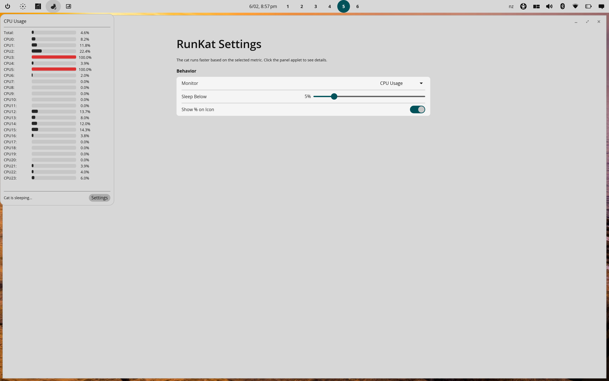

# cosmic-runkat

A cute running cat CPU indicator for the [COSMIC desktop environment](https://system76.com/cosmic) on Linux. Inspired by [RunCat](https://github.com/Kyome22/RunCat_for_windows) by Kyome22.


## Screenshots

**CPU Usage**


**CPU Frequency**


**CPU Temperature**


## Features

- **Native COSMIC Panel Applet**: Integrates directly into the COSMIC panel
- **Animated Cat**: A pixel art cat runs in your panel, speed driven by CPU usage, frequency, or temperature
- **Sleep Mode**: Cat curls up and sleeps when the metric drops below a configurable threshold
- **CPU Percentage Display**: Optional percentage shown beside the cat
- **Per-Core Popup**: Click the applet to see per-core CPU usage, frequency, and temperature stats
- **Theme-Aware**: Dynamically recolors the cat using COSMIC theme colors
- **Settings App**: libcosmic-based settings window for configuration

## Installation

### From Source

#### Prerequisites

- [Rust](https://rustup.rs/) toolchain (1.75+)
- [just](https://github.com/casey/just) command runner
- System libraries:

```bash
# Debian/Ubuntu/Pop!_OS
sudo apt install libwayland-dev libxkbcommon-dev libssl-dev pkg-config just

# Fedora
sudo dnf install wayland-devel libxkbcommon-devel openssl-devel just

# Arch
sudo pacman -S wayland libxkbcommon openssl just
```

#### Build and Install

```bash
git clone https://github.com/reality2-roycdavies/cosmic-runkat.git
cd cosmic-runkat

# Build release binary
just build-release

# Install binary, desktop entry, and icons to ~/.local
just install-local
```

#### Other just commands

```bash
just build-debug       # Debug build
just run               # Build debug and run
just run-release       # Build release and run
just check             # Run clippy checks
just fmt               # Format code
just clean             # Clean build artifacts
just uninstall-local   # Remove installed files
```

### Adding to the Panel

After installing, add the applet to your COSMIC panel:
1. Right-click the COSMIC panel → **Panel Settings**
2. Click **+ Add Applet**
3. Find **RunKat** and add it

### Uninstalling

```bash
rm ~/.local/bin/cosmic-runkat
rm ~/.local/share/applications/io.github.reality2_roycdavies.cosmic-runkat.desktop
rm ~/.local/share/icons/hicolor/scalable/apps/io.github.reality2_roycdavies.cosmic-runkat.svg
rm ~/.local/share/icons/hicolor/symbolic/apps/io.github.reality2_roycdavies.cosmic-runkat-symbolic.svg
rm -rf ~/.config/cosmic-runkat
```

## Usage

The applet runs as part of the COSMIC panel. Click it to open a popup showing per-core CPU stats.

```bash
# Open settings window directly
cosmic-runkat --settings

# Show help
cosmic-runkat --help
```

## Configuration

Configuration is stored at `~/.config/cosmic-runkat/config.json`:

| Option | Description | Default |
|--------|-------------|---------|
| `animation_source` | What drives the cat speed: `cpu-usage`, `frequency`, or `temperature` | `cpu-usage` |
| `sleep_threshold_cpu` | CPU % below which the cat sleeps | 5.0 |
| `sleep_threshold_freq` | Frequency (MHz) below which the cat sleeps | 1000.0 |
| `sleep_threshold_temp` | Temperature (°C) below which the cat sleeps | 40.0 |
| `max_fps` | Maximum animation speed (frames/sec) | 15.0 |
| `min_fps` | Minimum animation speed when running | 2.0 |
| `show_percentage` | Show CPU % beside the cat | true |

Settings can also be changed via the Settings window (click applet → Settings button, or run `cosmic-runkat --settings`).

## How It Works

1. **CPU Monitoring**: Uses `systemstat` crate to sample CPU usage every 500ms
2. **Frequency/Temperature**: Reads `/sys/devices/system/cpu/` and `/sys/class/hwmon/` for live data
3. **Animation Speed**: Linear interpolation between min/max FPS based on the selected metric
4. **Sleep Logic**: Cat sleeps when the metric drops below the configured threshold
5. **Sprite Rendering**: Cat animation frames loaded as embedded PNGs, recolored to match COSMIC theme
6. **Panel Integration**: Native COSMIC applet API with popup support

## Architecture

```
cosmic-runkat (v2.1.0)
├── src/
│   ├── main.rs        # Entry point, CLI parsing
│   ├── applet.rs      # Native COSMIC panel applet
│   ├── settings.rs    # libcosmic settings window
│   ├── config.rs      # Configuration with validation
│   ├── cpu.rs         # CPU monitoring with watch channels
│   ├── sysinfo.rs     # CPU frequency/temperature from sysfs
│   ├── theme.rs       # Theme detection (RON parsing)
│   ├── constants.rs   # Application-wide constants
│   └── error.rs       # Error types
├── resources/         # PNG sprites, icons, desktop entry, metainfo
└── docs/              # Development documentation
```

## About This Project

This project was developed as an **educational exercise** in collaborative AI-assisted software development, following the same approach used for [cosmic-bing-wallpaper](https://github.com/reality2-roycdavies/cosmic-bing-wallpaper). The entire application was built through iterative conversation between a human developer and Claude (Anthropic's AI) using Claude Code.

The complete development process, including conversations, design decisions, and technical analysis, has been documented in the [docs/](docs/) directory.

**See [docs/AI_DEVELOPMENT_CASE_STUDY.md](docs/AI_DEVELOPMENT_CASE_STUDY.md) for a detailed analysis of the v1.0.0 refactoring process.**

### Credits

- **Original Inspiration**: [RunCat](https://github.com/Kyome22/RunCat_for_windows) by Kyome22
- **COSMIC Desktop**: [System76's COSMIC](https://github.com/pop-os/cosmic-epoch)
- **Development**: Dr. Roy C. Davies and Claude (Anthropic's AI) using Claude Code

## License

MIT License - See [LICENSE](LICENSE) for details.

## Related COSMIC Applets

This is part of a suite of custom applets for the COSMIC desktop:

| Applet | Description |
|--------|-------------|
| **[cosmic-applet-settings](https://github.com/reality2-roycdavies/cosmic-applet-settings)** | Unified settings app for all custom COSMIC applets |
| **[cosmic-bing-wallpaper](https://github.com/reality2-roycdavies/cosmic-bing-wallpaper)** | Daily Bing wallpaper manager with auto-update |
| **[cosmic-pie-menu](https://github.com/reality2-roycdavies/cosmic-pie-menu)** | Radial/pie menu app launcher with gesture support |
| **[cosmic-tailscale](https://github.com/reality2-roycdavies/cosmic-tailscale)** | Tailscale VPN status and control applet |
| **[cosmic-hotspot](https://github.com/reality2-roycdavies/cosmic-hotspot)** | WiFi hotspot toggle applet |
| **[cosmic-konnect](https://github.com/reality2-roycdavies/cosmic-konnect)** | Device connectivity and sync between Linux and Android |
| **[cosmic-konnect-android](https://github.com/reality2-roycdavies/cosmic-konnect-android)** | Android companion app for Cosmic Konnect |

## Related Projects

- [RunCat](https://github.com/Kyome22/RunCat_for_windows) - The original inspiration for this project
- [minimon-applet](https://github.com/cosmic-utils/minimon-applet) - A similar COSMIC panel applet for system monitoring
